# AMCH-RAG: Complete Project Master Notebook & Handover Runbook
> **Document Purpose**: This notebook contains the complete end-to-end technical knowledge, architectural blueprint, configuration specifications, file-by-file component breakdown, operational workflows, past errors, and exact fixes for the **AMCH-RAG** (Agentic Multi-Modal Corrective Hybrid RAG) project. Any new CLI (Claude Code, Cursor, Windsurf, Aider, etc.) or developer reading this document can immediately take full charge of this codebase without missing any context.

---

## Table of Contents
1. [Executive Summary & Tech Stack](#1-executive-summary--tech-stack)
2. [End-to-End Architectural Blueprint](#2-end-to-end-architectural-blueprint)
3. [Repository Directory & File Map](#3-repository-directory--file-map)
4. [Backend Deep Dive (FastAPI & LangGraph)](#4-backend-deep-dive-fastapi--langgraph)
5. [Frontend Deep Dive (React 18 + Vite SPA)](#5-frontend-deep-dive-react-18--vite-spa)
6. [Vector Store & Qdrant Architecture](#6-vector-store--qdrant-architecture)
7. [Environment Configuration & Secrets](#7-environment-configuration--secrets)
8. [Critical Historical Bugs & Applied Permanent Fixes](#8-critical-historical-bugs--applied-permanent-fixes)
9. [Deployment Runbook (AWS EC2 & Local Windows)](#9-deployment-runbook-aws-ec2--local-windows)
10. [Testing & Verification Test Suite](#10-testing--verification-test-suite)
11. [Troubleshooting & Emergency Playbook](#11-troubleshooting--emergency-playbook)

---

## 1. Executive Summary & Tech Stack

**AMCH-RAG** is a production-grade, modular, agentic Retrieval-Augmented Generation system designed for zero-downtime, high-accuracy document intelligence. It combines:
- **Corrective RAG (CRAG)**: Document grading with fallback to web search (Tavily / DuckDuckGo) when context relevance is insufficient.
- **Self-Reflective RAG (Self-RAG)**: Automated post-generation hallucination and faithfulness checking with corrective generation retries.
- **Hybrid Dense + Lexical Search**: FastEmbed `BAAI/bge-small-en-v1.5` (384-dim dense vectors) + BM25 sparse vectors, fused via **Reciprocal Rank Fusion (RRF)**.
- **Local Cross-Encoder Reranking**: FlashRank (`ms-marco-TinyBERT-L-2-v2`) running locally with zero API latency or cost.
- **Multi-Modal Document Parsing**: Extracting tables, text, and PDF images (with Gemini Vision automated image captioning).
- **Two-Tier Caching (<5ms / <50ms)**: Exact SHA-256 hash caching (SQLite/Redis) + Qdrant semantic vector similarity caching ($\ge 0.90$).
- **Multi-Provider Resilient Model Gateway**: Automatic cascading fallback between **Groq** $\to$ **Google Gemini** $\to$ **OpenRouter**, equipped with 3-state finite-state circuit breakers.
- **Unified Full-Stack Delivery**: FastAPI mounts the pre-built React Single Page Application (SPA) directly at `/`, serving both the UI and backend APIs from port `8000`.

### Technologies
| Domain | Technologies |
| :--- | :--- |
| **Language & Runtime** | Python 3.12+, TypeScript 5+, Node.js (build only) |
| **Package Management** | `uv` (ultra-fast Python package manager) |
| **API Framework** | FastAPI 0.115+, Uvicorn, Pydantic v2 |
| **Agentic Framework** | LangGraph 0.2+, LangChain Core |
| **Vector DB & Storage** | Qdrant (native standalone binary / Docker container / local storage) |
| **Local Models** | FastEmbed (dense + BM25 sparse), FlashRank (reranker) |
| **LLM Gateway** | Groq (`qwen/qwen3.8-27b`), Gemini (`gemini-2.5-flash`), OpenRouter (`openrouter/auto`) |
| **Web Search** | Tavily AI Search API |
| **Frontend** | React 18, Vite 6/8, Tailwind CSS, Lucide React, Markdown-to-JSX |
| **Observability** | OpenTelemetry, Prometheus (`/metrics`), LangSmith |

---

## 2. End-to-End Architectural Blueprint

```mermaid
flowchart TD
    User([User / Browser]) -->|HTTP / SSE Stream| FastAPI[FastAPI App Port 8000]
    
    subgraph Frontend [React Single-Page Application]
        UserUI[UserAssistant.tsx - Chat UI]
        AdminUI[AdminCockpit.tsx - Admin Dashboard]
        DocModal[DocumentManagerModal.tsx]
    end
    
    FastAPI -->|Static Mount / & /assets| Frontend
    
    subgraph Ingestion [Ingestion Pipeline]
        UploadAPI[POST /ingest or /ingest/file]
        Parser[File Parser: PDF, DOCX, PPTX, CSV, TXT, URL]
        Chunker[Semantic Chunking & Overlap Engine]
        EmbedEngine[FastEmbed: Dense 384-d + BM25 Sparse]
        UploadAPI --> Parser --> Chunker --> EmbedEngine --> QdrantKB[(Qdrant: knowledge_base)]
    end

    subgraph Agent [LangGraph Agent Workflow]
        QueryAPI[POST /query] --> InputGuard[Input Guardrails: PII Redaction & Prompt Injection Shield]
        InputGuard --> Router{Router Node}
        
        Router -- "Greeting / Casual" --> QuickAns[Direct Synthesis]
        Router -- "Knowledge Query" --> CacheCheck{Two-Tier Cache}
        
        CacheCheck -- "Exact / Semantic Hit" --> StreamReturn[SSE Token Stream]
        CacheCheck -- "Cache Miss" --> MemoryRecall[Recall User Long-Term Memory]
        
        MemoryRecall --> HybridRetrieve[Qdrant Hybrid Dense + BM25 RRF Search]
        HybridRetrieve --> FlashRank[FlashRank Cross-Encoder Reranker]
        FlashRank --> CRAGGrader{CRAG Doc Grader}
        
        CRAGGrader -- "Relevant" --> Synthesize[LLM Synthesis with Citations]
        CRAGGrader -- "Insufficient" --> QueryRewrite[Query Rewrite Node]
        QueryRewrite --> WebFallback[Tavily Web Search] --> Synthesize
        
        Synthesize --> SelfRAG{Self-RAG Groundedness Check}
        SelfRAG -- "Hallucinated" --> SelfRAGCorrection[Corrective Generation Retry]
        SelfRAG -- "Faithful" --> OutputGuard[Output Guardrails & PII Check]
        SelfRAGCorrection --> OutputGuard
        
        OutputGuard --> StreamReturn
        StreamReturn --> CacheStore[Update Exact & Semantic Cache]
        StreamReturn --> MemoryStore[Save Extracted Facts to Qdrant user_memory]
    end

    subgraph VectorDB [Qdrant Vector Database Port 6333]
        QdrantKB
        QdrantCache[(Qdrant: semantic_cache)]
        QdrantMem[(Qdrant: user_memory)]
    end
```



---

## 3. Repository Directory & File Map

```text
AMCH-RAG/
├── app/                                 # Complete backend application
│   ├── main.py                          # FastAPI app entrypoint, lifespan, SPA static mount
│   ├── config.py                        # Settings model (pydantic-settings) reading .env
│   ├── observability.py                 # OpenTelemetry tracer & LangSmith hooks
│   ├── agent/                           # LangGraph agent implementation
│   │   ├── graph.py                     # LangGraph state machine workflow definition
│   │   ├── state.py                     # AgentState schema (messages, chunks, citations, loop counts)
│   │   └── nodes/                       # Functional node handlers
│   │       ├── router.py                # Greeting vs RAG classification
│   │       ├── cache_node.py            # Exact & semantic cache retrieval/storage
│   │       ├── retrieval_node.py        # Hybrid retriever integration
│   │       ├── rerank_node.py           # FlashRank reranker invocation
│   │       ├── crag_grader.py           # Document relevance evaluation
│   │       ├── web_search.py            # Tavily web fallback execution
│   │       ├── synthesis.py             # Response generation with in-line citation brackets [n]
│   │       ├── self_rag.py              # Hallucination & faithfulness checker
│   │       ├── guardrails.py            # PII redaction & prompt injection detector
│   │       └── memory_node.py           # Two-tier memory recall and factual extraction
│   ├── api/                             # FastAPI routers
│   │   ├── models.py                    # API request/response schemas
│   │   ├── routes_query.py              # POST /query (SSE stream & sync response)
│   │   ├── routes_ingest.py             # POST /ingest, /ingest/file, /ingest/url, GET /ingest/{id}
│   │   ├── routes_documents.py          # GET /documents, DELETE /documents/{id}, cache clear
│   │   ├── routes_feedback.py           # POST /feedback (trace feedback logging)
│   │   ├── routes_health.py             # GET /health (subsystem readiness check)
│   │   ├── routes_metrics.py            # GET /metrics (Prometheus telemetry exposition)
│   │   └── routes_admin.py              # /admin-api (memory and guardrail tuning)
│   ├── ingestion/                       # Multi-modal ingestion subsystem
│   │   ├── pipeline.py                  # Ingestion orchestrator & JobStore background tracker
│   │   ├── models.py                    # IngestJob, DocumentPayload, ChunkPayload schemas
│   │   ├── extractors/                  # Format-specific extractors (PDF, DOCX, CSV, HTML, TXT)
│   │   ├── chunker.py                   # Semantic & token window chunking
│   │   └── summarizer.py                # Document high-level summary generator for routing
│   ├── retrieval/                       # Retrieval subsystem
│   │   ├── vector_store.py              # VectorStoreManager (Qdrant client, auto-start, fallback)
│   │   ├── embeddings.py                # FastEmbed dense (bge-small) & sparse (BM25) engine
│   │   ├── reranker.py                  # FlashRank local cross-encoder service
│   │   └── retriever.py                 # HybridRetriever (RRF fusion + ACCESS_HIERARCHY ACL)
│   ├── models/                          # Resilient LLM Gateway
│   │   ├── gateway.py                   # ModelGateway (priority cascade + circuit breakers)
│   │   └── circuit_breaker.py           # CircuitBreaker finite state machine
│   ├── cache/                           # Two-tier caching service
│   │   └── service.py                   # TwoTierCacheService (SQLite/Redis + Qdrant semantic)
│   └── memory/                          # Two-tier memory service
│       └── service.py                   # TwoTierMemoryService (sliding window + Qdrant facts)
├── frontend/                            # React 18 + Vite frontend
│   ├── src/
│   │   ├── pages/
│   │   │   ├── UserAssistant.tsx        # ChatGPT-style chat interface with document upload & citations
│   │   │   └── AdminCockpit.tsx         # Comprehensive admin cockpit (cache, memory, ACL, telemetry)
│   │   ├── components/                  # UI components (DocumentManagerModal, Sidebar, Header, etc.)
│   │   ├── types.ts                     # TypeScript data interfaces
│   │   └── main.tsx                     # React root DOM mount
│   ├── dist/                            # PRE-BUILT PRODUCTION BUNDLE (Tracked in Git!)
│   │   ├── index.html                   # Static HTML entry point
│   │   └── assets/                      # Bundled CSS and JavaScript chunks
│   ├── package.json                     # NPM dependencies (Vite, Tailwind, Lucide, React)
│   └── vite.config.ts                   # Vite bundler configuration
├── bin/
│   └── qdrant.exe                       # Standalone Windows native Qdrant vector database (85 MB)
├── storage/
│   └── qdrant_server/                   # Qdrant persistent collections on disk
├── data/                                # Local uploads, SQLite cache, and embedded fallback
├── scripts/                             # Utility & test verification scripts
│   ├── test_resume_query.py             # End-to-end verification script for uploaded resume
│   └── run_full_evaluation.py           # 40-test automated benchmark scorecard
├── .env                                 # Local environment variables and API credentials
├── .gitignore                           # Git exclusion configuration
├── start.bat                            # Windows 1-click batch launcher
├── start.ps1                            # Windows PowerShell launcher
└── pyproject.toml                       # Python package dependencies configured for uv
```

---

## 4. Backend Deep Dive (FastAPI & LangGraph)

### 4.1 FastAPI App Lifecycle (`app/main.py`)
- **Startup (`lifespan`)**:
  1. Initializes OpenTelemetry tracing (`setup_tracer()`).
  2. Acquires `VectorStoreManager` instance and runs `ensure_collections()`.
  3. Launches background task to summarize any unsummarized documents for summary-guided query routing.
- **Static Mounting**:
  - Direct mounts `frontend/dist/assets` under `/assets`.
  - Catches all non-API paths and serves `frontend/dist/index.html` (enabling full HTML5 pushState routing).

### 4.2 Multi-Provider LLM Gateway (`app/models/gateway.py`)
- **Priority Cascade**: Order defined by `PROVIDER_PRIORITY` in `.env`:
  1. **Groq**: Extremely fast inference (`qwen/qwen3.8-27b`).
  2. **Google Gemini**: Large reasoning model (`gemini-2.5-flash` / `gemini-3.8-flash`).
  3. **OpenRouter**: Free universal fallback (`openrouter/auto`).
- **Circuit Breaker Mechanics**:
  - Each provider has an independent `CircuitBreaker`.
  - If a provider encounters repeated timeouts or 429 rate limits, its breaker transitions to `OPEN` for a 60-second cooldown period, automatically skipping it without wasting latency.
  - After cooldown, it enters `HALF_OPEN` state to test a single request. If successful, it returns to `CLOSED`.

### 4.3 LangGraph State Machine (`app/agent/graph.py`)
- Defined using `StateGraph(AgentState)`.
- State fields (`app/agent/state.py`):
  - `query`: Current user query.
  - `session_id`, `user_id`: Identifiers for memory scoping.
  - `access_level`: Tenant isolation level (`default`, `internal`, `confidential`, `admin`).
  - `retrieved_chunks`: List of context chunks retrieved from Qdrant / Web.
  - `citations`: Extracted source chunks mapped to numerical brackets `[1]`, `[2]`.
  - `response`: Final generated answer.
  - `evaluation`: Self-RAG groundedness score and critique.
  - `correction_count`: Number of corrective retries (capped at 2).

---

## 5. Frontend Deep Dive (React 18 + Vite SPA)

### 5.1 UserAssistant (`frontend/src/pages/UserAssistant.tsx`)
- Provides a clean, modern, personal-assistant conversational UI.
- Features:
  - **Live Server-Sent Events (SSE) Streaming**: Connects to `POST /query` with `stream: true`, progressively rendering markdown text as tokens arrive.
  - **In-Line Citations**: Displays clickable badge pills for references `[1]`, `[2]`, showing the source document name, page number, and chunk snippet in an expandable drawer.
  - **In-Chat Document Upload**: Paperclip / upload button allows uploading PDFs, DOCX, CSV, or TXT directly from chat.
  - **Session Management**: Multi-session conversation sidebar stored in `localStorage`.

### 5.2 Admin Cockpit (`frontend/src/pages/AdminCockpit.tsx`)
- Password-protected administrative control center.
- Capabilities:
  - **Document Catalog**: View all ingested files, chunk counts, access levels, and triggers atomic deletion with cache invalidation.
  - **Two-Tier Cache Inspector**: View exact hash hits and semantic cache entries; one-click cache purge button.
  - **Qdrant Collection Status**: Live chunk count and vector dimensional state for `knowledge_base`, `semantic_cache`, and `user_memory`.
  - **Long-Term Memory Management**: View and delete extracted persistent user facts.
  - **Guardrail Configuration**: Real-time tuning of groundedness thresholds, strict grounding toggles, and confidence gates.

---

## 6. Vector Store & Qdrant Architecture

### 6.1 Qdrant Collections
| Collection Name | Dense Vector | Sparse Vector | Purpose |
| :--- | :--- | :--- | :--- |
| **`knowledge_base`** | 384-dim (`BAAI/bge-small-en-v1.5`), Cosine | FastEmbed BM25 lexical | Stores all document chunks with payload (`doc_id`, `source`, `access_level`, `content`, `section`, `page`) |
| **`semantic_cache`** | 384-dim, Cosine | None | Stores query embeddings for $<50\text{ms}$ semantic similarity matching ($\ge 0.90$) |
| **`user_memory`** | 384-dim, Cosine | None | Stores user-specific persistent facts across sessions |

### 6.2 Self-Healing VectorStoreManager (`app/retrieval/vector_store.py`)
- Automatically checks if port `6333` is listening.
- If port `6333` is closed (e.g. system reboot):
  1. Checks if `bin/qdrant.exe` exists.
  2. Spawns `bin/qdrant.exe` in the background (using `CREATE_NO_WINDOW` on Windows).
  3. Polls until port `6333` is ready, then establishes the connection.
  4. If the binary is unavailable, seamlessly falls back to embedded storage at `./data/qdrant`.
- **Result**: The backend **never crashes with Connection Refused**.

---

## 7. Environment Configuration & Secrets

Located in `.env` (kept safe and never committed to Git):
```ini
# Primary Provider: Google Gemini
GEMINI_API_KEY=your_gemini_api_key_here
GEMINI_GENERATION_MODEL=gemini-3.8-flash
GEMINI_PRO_MODEL=gemini-3.8-flash

# Fallback Providers
GROQ_API_KEY=your_groq_api_key_here
GROQ_MODEL=qwen/qwen3.8-27b

OPENROUTER_API_KEY=your_openrouter_api_key_here
OPENROUTER_MODEL=openrouter/auto

PROVIDER_PRIORITY=["groq", "gemini", "openrouter"]

# Embeddings & Reranker
EMBEDDING_MODEL=BAAI/bge-small-en-v1.5
EMBEDDING_DIM=384
RERANKER_MODEL=ms-marco-TinyBERT-L-2-v2

# Vector DB
QDRANT_URL=http://localhost:6333
QDRANT_PATH=./data/qdrant
QDRANT_COLLECTION=knowledge_base

# Cache & Storage
REDIS_URL=
LOCAL_CACHE_PATH=./data/cache/cache.db
SEMANTIC_CACHE_THRESHOLD=0.90

# Agent Parameters
MAX_CORRECTION_ATTEMPTS=2
MAX_GROUNDEDNESS_RETRIES=2
ENABLE_WEB_SEARCH_FALLBACK=true

# Web Search
TAVILY_API_KEY=your_tavily_api_key_here

# LangSmith Tracing
LANGCHAIN_TRACING_V2=true
LANGCHAIN_API_KEY=your_langsmith_api_key_here
LANGCHAIN_PROJECT=AMCH-RAG
LANGCHAIN_ENDPOINT=https://api.smith.langchain.com
```

---

## 8. Critical Historical Bugs & Applied Permanent Fixes

### Bug 1: The "Uploaded Resume Not Found / Empty Retrieval" Bug
- **Symptom**: User uploaded a PDF resume (`Vaishnavi_Ningampet_Resume.pdf`) and asked questions like *"what is the name of the person whose resume i just shared"*. The assistant responded: *"I could not find any relevant information"*.
- **Root Cause**:
  1. `UserAssistant.tsx` line 360 and `DocumentManagerModal.tsx` line 81 hardcoded `formData.append('access_level', 'internal')` during upload.
  2. Queries sent to `POST /query` did not provide `access_level`, defaulting to `"default"`.
  3. In `retriever.py`, `ACCESS_HIERARCHY["default"]` only allowed `["default", "public"]`, which **strictly excluded `"internal"`**.
  4. Qdrant filtered out 100% of user chunks during retrieval.
- **Permanent Fix**:
  - Changed upload payloads in both components to `formData.append('access_level', 'default')`.
  - Added explicit `access_level: 'default'` to the `/query` payload in `UserAssistant.tsx`.
  - Modified `ACCESS_HIERARCHY` in `app/retrieval/retriever.py`:
    ```python
    ACCESS_HIERARCHY = {
        "admin": ["admin", "confidential", "internal", "default", "public"],
        "confidential": ["confidential", "internal", "default", "public"],
        "internal": ["internal", "default", "public"],
        "default": ["default", "public", "internal"],  # Allows default queries to access internal docs
        "public": ["public", "default"],
    }
    ```

### Bug 2: AWS EC2 `Command 'npm' not found`
- **Symptom**: When attempting to run `npm run build` on the AWS Ubuntu EC2 instance, the shell reported `Command 'npm' not found`.
- **Root Cause**: The EC2 instance did not have Node.js / NPM installed, and compiling on t2/t3.micro instances causes Out-Of-Memory (OOM) kernel panics.
- **Permanent Fix**:
  - The production frontend is compiled locally on Windows (`npm run build`).
  - Removed `frontend/dist/` from `.gitignore` and `frontend/.gitignore`.
  - Committed the pre-built `frontend/dist/` directly into GitHub.
  - On AWS, running `git pull origin main` delivers the complete ready-to-serve web application. No `npm` or Node is needed on AWS.

### Bug 3: AWS `pkill: killing pid failed: Operation not permitted`
- **Symptom**: On AWS, running `pkill -f uvicorn` failed with `Operation not permitted`.
- **Root Cause**: Uvicorn had previously been started under `sudo` (root), preventing standard user `ubuntu` from sending termination signals. Additionally, terminal was inside `~/AMCH-RAG/frontend` rather than `~/AMCH-RAG`.
- **Permanent Fix**:
  - Navigate to project root: `cd ~/AMCH-RAG`
  - Terminate with elevated permissions: `sudo pkill -9 -f uvicorn`
  - Launch using `nohup uv run uvicorn app.main:app --host 0.0.0.0 --port 8000 > app.log 2>&1 &`

### Bug 4: Qdrant Daemon Crash on System Restart
- **Symptom**: After Windows or EC2 restart, `qdrant.exe` died, causing all ingestion and retrieval jobs to throw `WinError 10061 Connection Refused`.
- **Permanent Fix**:
  - Implemented self-healing auto-launch inside `VectorStoreManager.__init__` in `app/retrieval/vector_store.py`. If port 6333 is not listening, it automatically spins up `bin/qdrant.exe`.
  - Created `start.bat` and `start.ps1` for 1-click Windows startup.

---

## 9. Deployment Runbook (AWS EC2 & Local Windows)

### 9.1 Local Windows Runbook
To run everything locally:
1. Double-click `start.bat` (or run `./start.ps1` in PowerShell).
2. The script will:
   - Check if Qdrant is running on `6333`, starting `bin\qdrant.exe` if needed.
   - Launch your browser to `http://localhost:8000`.
   - Start Uvicorn running `app.main:app`.

### 9.2 AWS Ubuntu EC2 Deployment Runbook
Whenever code is updated on GitHub:
```bash
# 1. Navigate to the root directory
cd ~/AMCH-RAG

# 2. Pull latest code (includes pre-built frontend dist)
git pull origin main

# 3. Verify Qdrant is running
curl -s http://localhost:6333/collections
# If down: docker start qdrant || docker run -d -p 6333:6333 -p 6334:6334 -v $(pwd)/storage/qdrant_server:/qdrant/storage:z qdrant/qdrant

# 4. Stop existing uvicorn process
sudo pkill -9 -f uvicorn

# 5. Start new uvicorn instance in background
nohup uv run uvicorn app.main:app --host 0.0.0.0 --port 8000 > app.log 2>&1 &

# 6. Verify health
curl http://localhost:8000/health
```

---

## 10. Testing & Verification Test Suite

### 10.1 Test Resume Query Verification
To verify that the agent graph retrieves and answers questions accurately from uploaded documents:
```bash
.\.venv\Scripts\python.exe scripts/test_resume_query.py
```
**Expected Output**:
- Query: *"what is the name of the person whose resume i just shared"* $\to$ Returns: *"The name of the person whose resume was shared is Vaishnavi Ningampet [1]."*
- Query: *"what are the skills from the document i uploaded"* $\to$ Returns categorized list of technical skills, strengths, and certifications with exact citation brackets.

### 10.2 Full System Benchmark Suite
To execute the comprehensive 40-test automated validation suite:
```bash
.\.venv\Scripts\python.exe scripts/run_full_evaluation.py
```
This tests:
1. Exact Cache Subsystem (<5ms)
2. Semantic Cache Subsystem (<50ms)
3. Hybrid Dense + Lexical Retrieval & RRF Fusion
4. FlashRank Local Cross-Encoder Reranking
5. CRAG Relevance Grader & Web Search Fallback
6. Self-RAG Groundedness & Hallucination Prevention
7. Two-Tier Memory Recall
8. Input/Output Guardrails & PII Redaction

---

## 11. Troubleshooting & Emergency Playbook

| Issue | Likely Cause | Solution |
| :--- | :--- | :--- |
| **Port 8000 already in use** | Stray uvicorn process | On Windows: `Stop-Process -Id (Get-NetTCPConnection -LocalPort 8000).OwningProcess -Force`<br>On Linux: `sudo fuser -k 8000/tcp` |
| **Port 6333 connection refused** | Qdrant daemon stopped | On Windows: Run `.\bin\qdrant.exe`<br>On Linux: `docker start qdrant` |
| **"I could not find relevant information"** | Document not ingested or access level mismatch | Check `GET /documents` to ensure `doc_id` is present. Ensure query has `access_level: 'default'`. |
| **LLM 429 Rate Limit Warning** | Free tier provider rate limit | The `ModelGateway` automatically fails over to Gemini or OpenRouter. Cooldown resets within 60s. |
| **Frontend changes not appearing** | Stale static cache | Run `npm run build` in `frontend/`, commit `frontend/dist`, and pull on the server. Hard-refresh browser (`Ctrl + Shift + R`). |

---
*End of Master Notebook. AMCH-RAG is maintained and verified.*
