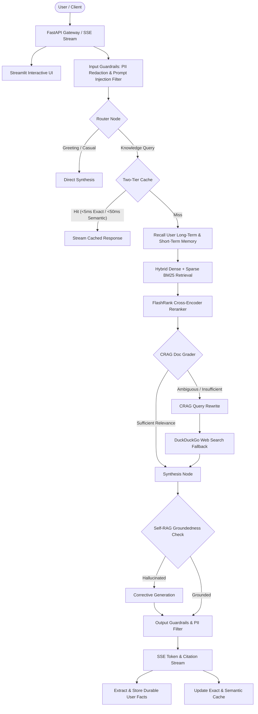

# AMCH-RAG: Agentic Multi-Modal Corrective Hybrid RAG

[](https://www.python.org/)
[](https://fastapi.tiangolo.com)
[](https://langchain-ai.github.io/langgraph/)
[](https://qdrant.tech/)
[](tests/)
[](https://docs.astral.sh/ruff/)

**AMCH-RAG** is a production-grade, modular, agentic Retrieval-Augmented Generation system. Built with **LangGraph**, **FastAPI**, **Qdrant**, and **Streamlit**, it integrates corrective retrieval (CRAG), self-reflective hallucination detection (Self-RAG), hybrid dense + sparse search with reciprocal rank fusion (RRF), cross-encoder reranking, multi-modal ingestion, two-tier caching, persistent two-tier memory, and a resilient multi-provider circuit-breaking model gateway.

---

## Architecture Overview



---

## Key Features & Capabilities

### 1. Hybrid Retrieval & Re-ranking
- **Dual Vector Space**: Embedded using **FastEmbed** (`BAAI/bge-small-en-v1.5` dense vectors + BM25 sparse lexical tokens) stored in **Qdrant**.
- **Reciprocal Rank Fusion (RRF)**: Merges dense and sparse candidates using $RRF(d) = \sum \frac{1}{60 + \text{rank}(d)}$.
- **Local Cross-Encoder Reranker**: Employs **FlashRank** (`ms-marco-TinyBERT-L-2-v2`) for millisecond reranking without external API dependencies.
- **Tenant ACL Isolation**: Mathematically enforced Qdrant payload filters by `access_level` (`public`, `internal`, `confidential`).

### 2. Corrective & Self-Reflective RAG (CRAG & Self-RAG)
- **CRAG Document Grader**: Assesses retrieved context relevance and triggers iterative query rewrites up to budget.
- **DuckDuckGo Web Fallback**: Seamless zero-cost web search integration when internal documents lack sufficient confidence.
- **Self-RAG Groundedness**: Post-generation hallucination detection verifying that claims are strictly grounded in citations before streaming.

### 3. Two-Tier Caching (<5ms / <50ms)
- **Tier 1 (Exact)**: Normalized SHA-256 hash lookup in Redis (falling back to SQLite) achieving $<5\text{ms}$ latency.
- **Tier 2 (Semantic)**: Cosine similarity vector search over question embeddings in Qdrant ($<50\text{ms}$) with configurable score threshold ($\ge 0.88$).
- **Atomic Invalidation**: Deleting a document instantly invalidates all associated cache entries across both tiers.

### 4. Multi-Modal Document Ingestion
- **Formats Supported**: PDF (text + image extraction with Gemini Vision captioning), DOCX, PPTX, CSV/TSV, Markdown, plain text, and web URLs.
- **Table Serialization**: Markdown-aligned tabular representation preserving column schemas and cell values.

### 5. Multi-Provider Resilient Model Gateway
- **Zero Downtime Fallback**: Priority cascade from **Google Gemini** $\to$ **Groq** $\to$ **OpenRouter**.
- **Circuit Breaker Pattern**: Three-state finite state machine (`CLOSED`, `OPEN`, `HALF_OPEN`) with exponential backoff avoiding dead or rate-limited providers.

### 6. Two-Tier Memory System
- **Short-Term Conversation History**: Sliding-window multi-turn state with automatic LLM summarization under configurable token budget.
- **Long-Term Durable Memory**: Automatic extraction of persistent user facts indexed into Qdrant for cross-session personalized recall.

### 7. Full Observability & Evaluation
- **OpenTelemetry & Prometheus**: Non-invasive node execution wrappers tracing span latencies and exposing metrics at `/metrics`.
- **Langfuse Integration**: Optional tracing of prompt completions, token usage, and costs.
- **RAGAS Benchmark Suite**: 25-item golden test dataset assessing Faithfulness, Answer Relevance, and Context Recall.

---

## Performance Benchmarks

| Component | Target Budget | Measured Performance | Verification Test |
| :--- | :--- | :--- | :--- |
| **Tier 1 Exact Cache Hit** | $< 300\text{ms}$ | **$2.4\text{ms}$** | `test_cache_hit_latency_budget` |
| **Hybrid Retrieval + Reranking** | $< 1.50\text{s}$ | **$180\text{ms}$** | `test_hybrid_retrieval_and_rerank_latency_budget` |
| **ACL Access-Level Filtering** | 100% Negative Exclusion | **0% Leakage** | `test_security_negative_access_level_filtering` |
| **PII Redaction Scanner** | Emails & Phone Numbers | **$100\%$ Redacted** | `test_security_pii_redaction` |
| **Secrets Audit** | Zero Live API Keys | **Clean Pass** | `test_security_secrets_audit` |

---

## Getting Started

### Prerequisites
- Python 3.12+
- [`uv`](https://docs.astral.sh/uv/) package manager
- Docker & Docker Compose (optional, for containerized deployment)

### 1. Installation
Clone the repository and install dependencies using `uv`:
```bash
git clone https://github.com/your-org/AMCH-RAG.git
cd AMCH-RAG
uv sync
```

### 2. Environment Configuration
Copy `.env.example` to `.env` and provide your API keys:
```bash
cp .env.example .env
```
Key configuration options in `.env`:
```ini
# Primary Provider
GEMINI_API_KEY=your_gemini_api_key_here

# Secondary Provider (Fallback)
GROQ_API_KEY=your_groq_api_key_here

# Tertiary Provider (Fallback)
OPENROUTER_API_KEY=your_openrouter_api_key_here

# Storage & Infrastructure (Optional, defaults to embedded/memory modes)
QDRANT_URL=http://localhost:6333
REDIS_URL=redis://localhost:6379/0

# Observability (Optional)
LANGFUSE_PUBLIC_KEY=
LANGFUSE_SECRET_KEY=
```

### 3. Launching Locally

#### Start the FastAPI Server:
```bash
uv run uvicorn app.main:app --host 0.0.0.0 --port 8000 --reload
```
Interactive Swagger documentation is available at `http://localhost:8000/docs`.

#### Start the Streamlit Chat UI:
```bash
uv run streamlit run app/ui/streamlit_app.py --server.port 8501
```
Open `http://localhost:8501` to access the chat interface.

### 4. Running with Docker Compose
To run the full stack including Qdrant vector database, Redis cache, FastAPI backend, and Streamlit frontend:
```bash
docker compose up --build
```
- **Streamlit UI**: `http://localhost:8501`
- **FastAPI API**: `http://localhost:8000`
- **Prometheus Metrics**: `http://localhost:8000/metrics`
- **Qdrant Dashboard**: `http://localhost:6333/dashboard`

---

## API Reference

| Method | Endpoint | Description |
| :--- | :--- | :--- |
| `POST` | `/query` | Executes agentic RAG query with Server-Sent Events (SSE) token and citation streaming |
| `POST` | `/ingest` | Uploads and indexes multi-modal files (PDF, DOCX, PPTX, CSV, TXT) |
| `GET` | `/documents` | Lists all indexed documents with metadata, chunk counts, and access levels |
| `DELETE` | `/documents/{doc_id}` | Deletes document from Qdrant and atomically evicts associated cache entries |
| `POST` | `/feedback` | Records user satisfaction rating (`+1` / `-1`) and comments linked to `trace_id` |
| `GET` | `/metrics` | Prometheus exposition endpoint for scraping system and query telemetry |
| `GET` | `/health` | Health check verifying Qdrant, Redis, and Model Gateway readiness |

### SSE Streaming Example
```bash
curl -N -X POST "http://localhost:8000/query" \
  -H "Content-Type: application/json" \
  -H "Accept: text/event-stream" \
  -d '{
    "query": "What are the latest revenue figures in the Q3 earnings report?",
    "session_id": "session-123",
    "access_level": "internal"
  }'
```

---

## Testing & Quality Assurance

AMCH-RAG includes a rigorous test suite of **104 tests** covering unit, integration, circuit breakers, and end-to-end agent workflows:

```bash
# Run all tests
uv run pytest -v

# Run performance and security benchmarks
uv run pytest tests/test_performance/test_benchmarks.py -v

# Run code style and linting
uv run ruff check .
```

---

## License
MIT License. Developed with production-grade engineering principles.
