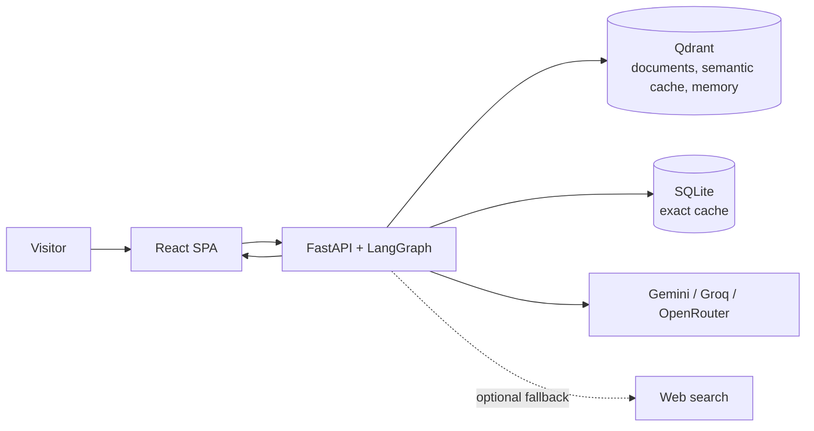

# AMCH-RAG

[](https://www.python.org/)
[](https://fastapi.tiangolo.com/)
[](https://langchain-ai.github.io/langgraph/)
[](https://qdrant.tech/)

**Agentic Multi-Modal Corrective Hybrid RAG** — a document question-answering demo built with FastAPI, LangGraph, Qdrant, and React. Ask questions about uploaded files and get answers with source citations; when retrieval is weak, the agent can retry with a rewritten query and optionally use labeled web results.

> **Portfolio project:** this repository demonstrates a single-instance application, not a hardened multi-tenant service. Do not upload sensitive documents to a public demo.

**Live demo:** [Open AMCH-RAG](http://44.204.217.194/)

| [Architecture](docs/ARCHITECTURE.md) | [Demo walkthrough](docs/DEMO_GUIDE.md) | [AWS deployment](AWS_FREE_TIER_DEPLOYMENT_GUIDE.md) | [Interview notes](docs/INTERVIEW_NOTES.md) |

## What the project demonstrates

- **Hybrid retrieval:** local 384-dimensional FastEmbed vectors and BM25 sparse vectors, fused with Qdrant RRF.
- **Reranking and correction:** local FlashRank cross-encoder, relevance grading, bounded query rewriting, and optional web fallback.
- **Grounded answers:** citations tied to retrieved chunks, a groundedness check, and bounded regeneration before the answer is returned.
- **Document ingestion:** PDF, DOCX, PPTX, CSV, Markdown, text, HTML, and URL ingestion; file uploads default to a configurable 20 MiB limit. PDFs can include image captions when Gemini Vision is configured.
- **Resilient model calls:** configurable Gemini, Groq, and OpenRouter provider cascade with circuit breakers.
- **Operational basics:** SQLite exact-answer cache, Qdrant semantic cache and vector storage, health endpoint, metrics, and containerized AWS deployment.

## Try the demo

1. Open the [live AWS demo](http://44.204.217.194/).
2. Upload [`examples/demo_company_handbook.md`](examples/demo_company_handbook.md).
3. Ask “What is the remote-work allowance?” and check that the answer cites the handbook.
4. Ask “What is the latest release of Python?” to see how an out-of-document question is handled; web fallback depends on configuration and provider availability.
5. Open `/health` to check service and vector-store health.

For a repeatable interview presentation, see the [demo walkthrough](docs/DEMO_GUIDE.md). Use only the synthetic example document in a public demo.

## Architecture at a glance

The diagrams use C4-inspired context, container, and component views, plus runtime sequences and deployment boundaries. The detailed views and implementation notes are in [docs/ARCHITECTURE.md](docs/ARCHITECTURE.md).



## Run locally

### Requirements

- Python 3.11 or 3.12
- [`uv`](https://docs.astral.sh/uv/)
- API key for at least one configured model provider
- Docker (optional, for the complete local stack)

### Install and configure

```bash
git clone https://github.com/nakul143naps/AMCH-RAG.git
cd AMCH-RAG
uv sync
```

Copy `.env.example` to `.env`, then set at least one provider key (`GEMINI_API_KEY`, `GROQ_API_KEY`, or `OPENROUTER_API_KEY`). Keep `.env` private; it is ignored by Git.

### Start the API and React app

```bash
uv run uvicorn app.main:app --host 127.0.0.1 --port 8000
```

Open `http://localhost:8000`. FastAPI serves the prebuilt React app from `frontend/dist`. The project includes that bundle; Node.js is only needed if you edit and rebuild the frontend:

```bash
cd frontend
npm ci
npm run build
```

If Qdrant is not configured as a server, the application can use its local embedded store. To run the Docker Compose deployment instead:

```bash
docker compose up --build
```

The Compose stack serves the app on port `80`, with the FastAPI port also mapped to `8000` for development/debugging. Qdrant’s host port is bound to loopback only. Do not expose the Qdrant dashboard to the public internet.

## API and operations

| Endpoint | Purpose |
|---|---|
| `POST /query` | Ask a question; supports Server-Sent Events (SSE) |
| `POST /ingest` | Upload and asynchronously index a supported file |
| `POST /ingest/url` | Ingest a web page |
| `GET /ingest/{job_id}` | Check an ingestion job |
| `GET /documents` | List indexed documents |
| `DELETE /documents/{doc_id}` | Delete a document and invalidate linked caches |
| `GET /health` | Check application, Qdrant, cache, and configured provider status |
| `GET /metrics` | Prometheus metrics |
| `GET /docs` | Interactive API documentation |

## Tests and code quality

```bash
uv run pytest -q
uv run ruff check .
```

Focused resume retrieval and API regression tests live under `tests/test_agent` and `tests/test_api`. See the [demo walkthrough](docs/DEMO_GUIDE.md) for manual checks.

## Deployment and demo limitations

The AWS EC2 deployment is intended for portfolio demonstration. It runs a small single-instance stack and may be unavailable during maintenance or if the instance stops. The demo is not a security boundary: there is no full user authentication or multi-tenant authorization. Do not expose Qdrant, upload private documents, or assume the deployment is suitable for sensitive data or production workloads.

For deployment and update commands, use the [AWS guide](AWS_FREE_TIER_DEPLOYMENT_GUIDE.md). For architecture and the distinction between implemented behavior and possible extensions, see [docs/ARCHITECTURE.md](docs/ARCHITECTURE.md).
