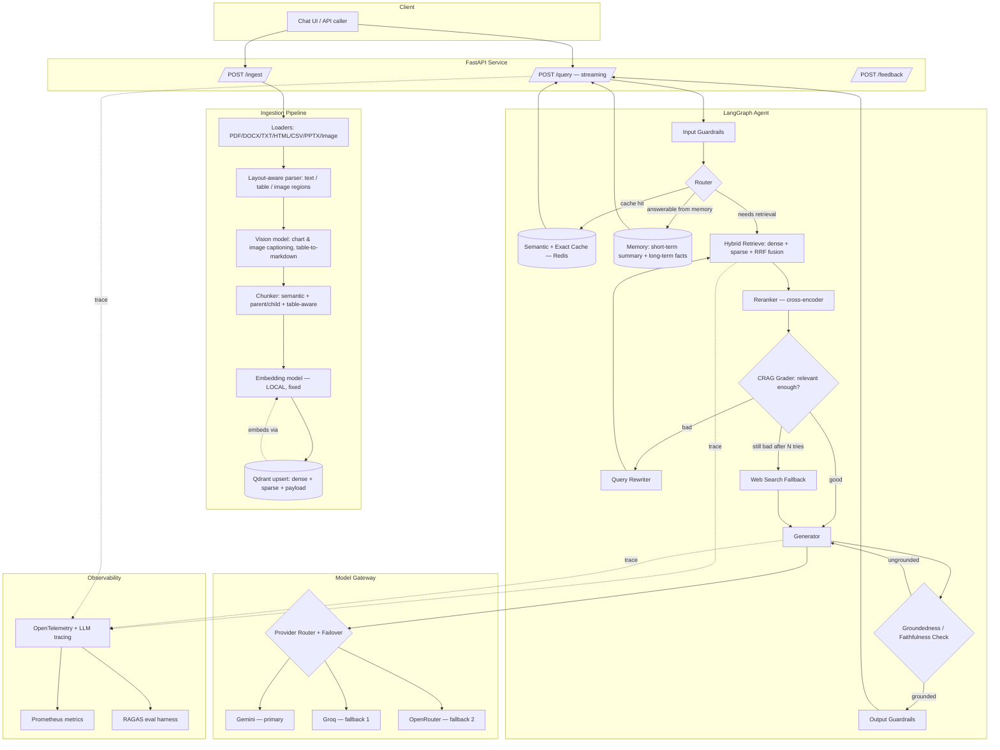

# ARCHITECTURE — AMCH-RAG

## 1. System Overview

## 2. Why Agentic (LangGraph, not a linear chain)

A linear "retrieve → generate" chain can't skip retrieval, can't retry with a better query, and can't decide to use a tool instead. AMCH-RAG is modeled as a **LangGraph `StateGraph`**: a directed graph of nodes over a shared, typed state object, with conditional edges. This is what makes "corrective" and "agentic" real rather than marketing words — the graph has actual branches for "retrieval was bad, try again" and "this doesn't need retrieval at all."

Core state fields (full schema in `DESIGN.md`): `query`, `chat_history`, `cache_hit`, `retrieved_docs`, `relevance_grades`, `correction_attempts`, `rewritten_query`, `web_results`, `draft_answer`, `groundedness_score`, `guardrail_flags`, `citations`, `trace_id`.

## 3. Component Breakdown

### 3.1 Ingestion Pipeline
- **Loaders**: format-specific loaders behind a common `DocumentLoader` interface — `unstructured` / `docling`-style layout-aware parsing for PDFs/DOCX/PPTX so tables and multi-column pages don't collapse into garbled text; `trafilatura`/`playwright` for websites (handles JS-rendered pages); native parsers for TXT/MD/CSV.
- **Layout-aware parsing**: splits a page into regions — body text, table, figure/image — instead of flattening everything to one text blob.
- **Vision pass**: every detected image/chart/figure is sent to a vision-capable model (Gemini's multimodal input) to produce a structured caption + extracted data points ("bar chart, 2019–2024 revenue, values: …"). Tables are serialized to Markdown (preserves row/column structure far better than plain text).
- **Chunking strategy**: semantic chunking for prose (split on topic shift, not fixed token count); small-to-big / parent-child for long documents (embed small child chunks for retrieval precision, return the larger parent chunk for generation context); table chunks kept whole (one table = one chunk, up to a size cap) since splitting a table mid-row destroys meaning.
- **Embedding**: see §7 — a single, fixed, local embedding model. Ingestion never silently switches embedding models.
- **Upsert**: Qdrant collection with named dense + sparse vectors and a rich payload (schema in `DESIGN.md`).

### 3.2 Vector Store — Qdrant (self-hosted)
- One collection per corpus (or namespaced via payload `tenant_id` if you later need multi-tenancy).
- **Named vectors**: `dense` (semantic embedding) + `sparse` (BM25/SPLADE-style term vector) on the same point, enabling Qdrant's native hybrid **Query API** with `prefetch` + fusion (RRF) in a single round trip instead of two separate searches you merge yourself.
- Payload filtering (source, doc type, access level, date) is applied *during* the vector search, not as a post-filter — cheaper and more correct.

### 3.3 Cache Layer (Redis)
- **Exact cache**: normalized-query hash → cached answer + citations. TTL configurable per query type.
- **Semantic cache**: embed the incoming query, search a small "recent Q&A" vector index (also Qdrant, or Redis with a vector index); if similarity ≥ threshold (start at 0.92, tune from eval data), return the cached answer. This is what answers "or similar type of questions are already answered" from the brief — it's a genuine architectural layer, not a string match.
- Cache entries store *which chunks* backed the answer, so a cache hit still carries valid citations, and a document update can invalidate affected cache entries.

### 3.4 Retrieval + Reranking
- Hybrid retrieval: dense + sparse fused with **Reciprocal Rank Fusion** (Qdrant does this natively via its Query API `prefetch`).
- **Reranker**: cross-encoder re-scores the fused top-N candidates before the top-k is handed to generation — this consistently outperforms fusion score alone, especially for precision-sensitive queries.
- Query transformation happens *before* retrieval: HyDE (generate a hypothetical answer, embed that instead of the raw query — helps short/ambiguous queries), multi-query (generate 2–3 paraphrases, retrieve for each, dedupe), decomposition (split a multi-part question into sub-questions, retrieve per sub-question).

### 3.5 Agentic Control (LangGraph nodes)
- **Router**: single fast LLM call (or a small classifier) that decides: `cache` / `memory` / `retrieve` / `tool_call`. This is the piece that stops the system from always retrieving.
- **Corrective RAG (CRAG) grader**: scores each retrieved chunk as relevant/ambiguous/irrelevant. If the top results are mostly irrelevant: rewrite the query (using the original query + why it failed) and retry retrieval, up to a bounded number of attempts; if still bad, fall back to a web search tool and clearly label the answer as web-sourced rather than knowledge-base-sourced.
- **Self-RAG / groundedness check**: after a draft answer is generated, a separate check (LLM-as-judge, cheap model) verifies every claim in the draft is supported by the retrieved context. Ungrounded claims trigger a regeneration constrained to only what's supported, or an explicit "the knowledge base doesn't cover this confidently" response — never a silently hallucinated answer.

### 3.6 Memory
- **Short-term**: conversation buffer with automatic summarization once it exceeds a token budget (LangGraph checkpointer persists this per session/thread).
- **Long-term**: durable facts extracted from conversations (explicit user preferences, recurring clarifications) stored as their own payload type in Qdrant, retrievable via the same hybrid search as documents, scoped per user.

### 3.7 Guardrails
- **Input**: prompt-injection / jailbreak pattern + classifier check on the user query *and* on retrieved content (documents can contain injected instructions — this is a real, common attack vector against RAG systems and must be checked, not just the user's literal message); PII detection before anything is logged or cached.
- **Output**: the groundedness check (§3.5) doubles as a hallucination guardrail; a lightweight toxicity/safety classifier on the final response; citation verification (every citation marker actually points to a chunk that supports the adjacent claim).

### 3.8 Model Gateway (multi-provider failover)
- All LLM calls (generation, grading, routing, groundedness checks, query rewriting) go through one gateway function — nothing in the graph calls a provider SDK directly.
- **Priority chain** (configurable, see `DESIGN.md` for config format): Gemini (primary, using your Gemini AI Pro subscription for higher throughput) → Groq (free, very low latency, good open-weight models — great first fallback) → OpenRouter (free tier, broadest catalog — second fallback, also useful if you want to swap in a different model family later without code changes).
- Failover triggers: HTTP 429/5xx, timeout, or explicit provider outage; retried with exponential backoff on the *same* provider first, then falls through the chain. A circuit breaker avoids hammering a provider that's clearly down.
- Because all three providers are OpenAI-compatible or have thin adapters, the gateway is a thin abstraction (LiteLLM or a small hand-rolled router — decide in `TASKS.md` Phase 11) rather than bespoke per-provider logic scattered through the codebase.

### 3.9 Observability
- **Tracing**: every graph node emits an OpenTelemetry span; an LLM-specific tracer (e.g. self-hosted Langfuse, which has a generous open-source tier) captures prompts, completions, token counts, cost, and latency per call, linked into one trace per request.
- **Metrics**: Prometheus counters/histograms for cache hit rate, retrieval latency, correction-loop trigger rate, provider failover count, groundedness pass rate.
- **Eval harness**: a golden Q&A set scored with RAGAS-style metrics (faithfulness, answer relevancy, context precision/recall) runnable on demand and wired into CI so a prompt or chunking change that regresses quality is caught before merge.

### 3.10 API Layer
- FastAPI, async throughout. Streaming via Server-Sent Events for `/query` (token stream + citation events interleaved).
- Full endpoint contract in `DESIGN.md` §5.

## 4. Data Flow — Happy Path Query
1. Request hits `/query` → input guardrails.
2. Router checks exact cache → semantic cache → memory-answerable → else retrieve.
3. Hybrid retrieve (dense+sparse, RRF) → rerank.
4. CRAG grader scores results as relevant → generate.
5. Groundedness check passes → output guardrails → stream to client with citations.
6. Everything traced; cache written for future identical/similar queries.

## 5. Data Flow — Corrective Path
1–2 same as above, retrieval runs.
3. Grader finds results mostly irrelevant.
4. Query rewriter reformulates (bounded to N attempts) → retrieve again.
5. If still poor: web search tool fallback, answer explicitly labeled as web-sourced.
6. Generate → groundedness check → (regenerate if ungrounded, bounded retries) → guardrails → stream.

## 6. Tech Stack

| Layer | Choice | Why |
|---|---|---|
| Language | Python 3.11+ | Ecosystem fit for LangChain/LangGraph + ML libs |
| Orchestration | LangChain + LangGraph | LangGraph gives real branching/looping agent control; LangChain supplies loaders/integrations |
| API | FastAPI + Uvicorn | Async-native, streaming support, typed with Pydantic |
| Vector DB | Qdrant (self-hosted, Docker) | Native hybrid search (dense+sparse+RRF) in one query, payload filtering, good local/self-hosted story |
| Cache/session store | Redis | Exact cache, session/checkpoint store, rate-limit counters |
| Primary LLM | Gemini (3.x family) via Gemini API / Google AI Studio | You already hold a Gemini AI Pro subscription → higher throughput and access to Pro-tier models |
| Fallback LLMs | Groq (free), OpenRouter (free tier) | Free, fast, OpenAI-compatible — cheap insurance against provider outages/rate limits |
| Embeddings | Local (fastembed, e.g. BAAI/bge-small-en-v1.5) | Fixed, free, zero external dependency for the most failure-critical path — see §7 |
| Reranker | Local cross-encoder (fastembed reranker) | Free, no external dependency, fast enough for small/medium corpora |
| Document parsing | `unstructured` / `docling` | Layout-aware, table/figure-region detection |
| Vision captioning | Gemini multimodal input | Already available via the primary provider; no extra integration |
| Web scraping | `trafilatura` + `playwright` | Handles both static and JS-rendered pages |
| Observability | OpenTelemetry + Langfuse (self-hosted) + Prometheus/Grafana | LLM-specific tracing plus standard infra metrics |
| Eval | RAGAS | Standard, well-supported RAG eval metrics |
| Guardrails | Custom rules + lightweight classifier models (+ optionally `presidio` for PII) | Keeps guardrails inspectable and fast; not a black box |
| Containerization | Docker Compose | Qdrant, Redis, API, worker, Langfuse — one `docker compose up` for local dev |

## 7. Key Design Decision: Embeddings Are Fixed, Not Failed-Over

This is the one place where "just add a fallback provider" (which works great for the LLM) would quietly break the system, so it's worth calling out explicitly:

**Two different embedding models do not produce comparable vectors.** If ingestion embeds with Gemini's embedding model today and, because of a rate limit, silently falls back to a different provider's embedding model tomorrow, the new vectors will not be meaningfully comparable to the old ones in the same collection — retrieval quality silently degrades and nobody can tell why.

**Decision**: the embedding model is **fixed and versioned**, not part of the provider-failover chain.
- Default choice: a strong local open-source embedding model (via `fastembed`, e.g. `BAAI/bge-small-en-v1.5` or similar), which also removes an entire class of outage — ingestion and query-time embedding both keep working even if every remote LLM provider is down.
- If you later want higher-quality embeddings from Gemini's embedding endpoint instead, that's a **deliberate migration**: re-embed the whole corpus into a new collection (or new named vector), then cut traffic over — never a runtime auto-switch.
- LLM generation, grading, routing, and groundedness checks have no such constraint — those genuinely benefit from the Gemini → Groq → OpenRouter failover chain in §3.8, because swapping which model *reasons* about the same retrieved text between calls is safe.

## 8. Deployment (local self-hosted target)
`docker-compose.yml` services: `api` (FastAPI app), `worker` (async ingestion jobs, via e.g. Celery/RQ or a simple task queue), `qdrant`, `redis`, `langfuse` (optional, observability), `prometheus` + `grafana` (optional, metrics dashboards). Environment/config via `.env` (see `DESIGN.md` §6 for required keys). This matches the "Qdrant self-hosted/local" decision — everything else in the stack is also designed to run fully locally except the LLM calls themselves.
