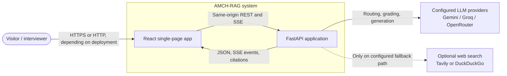
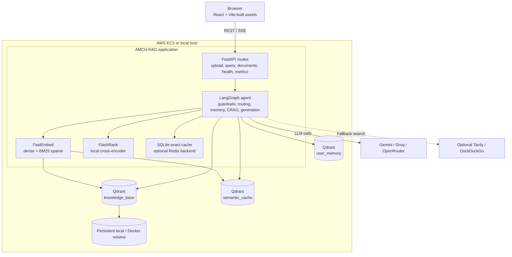
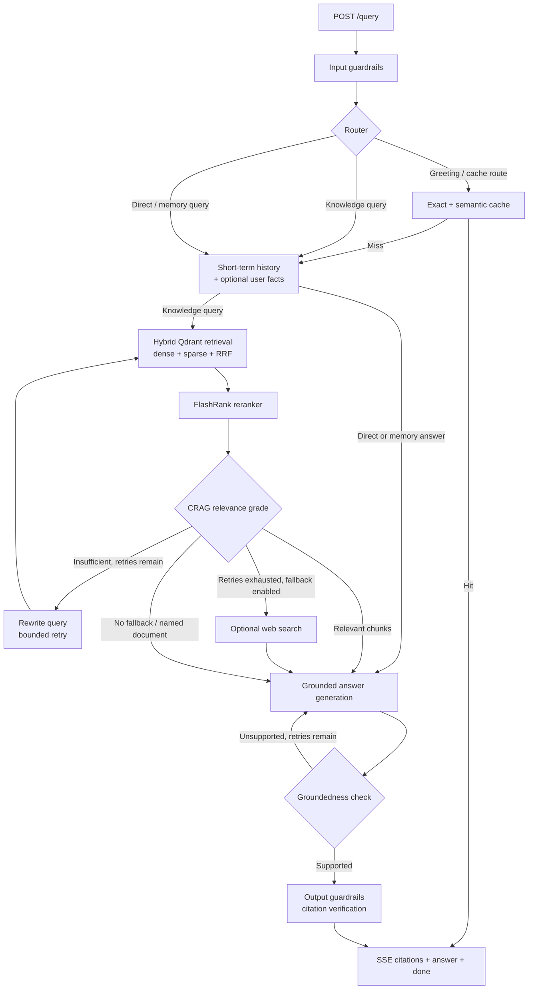
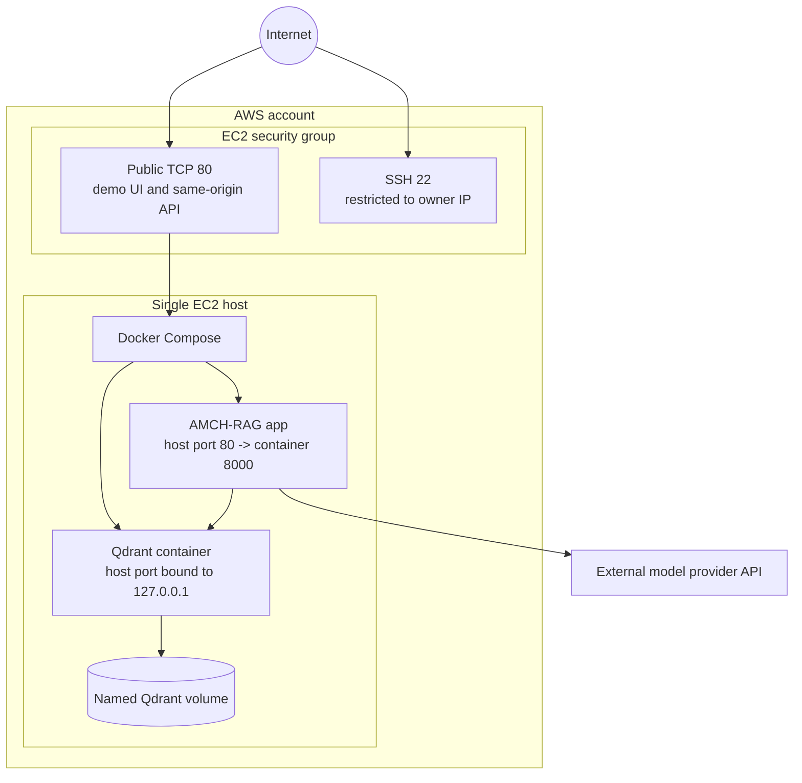

# AMCH-RAG Architecture

This document describes the implementation in this repository. It uses C4-inspired system-context, container, and component views, followed by runtime sequences and the demo deployment view. The diagrams are intentionally limited to components that exist in the codebase; optional integrations are marked.

## 1. System context

AMCH-RAG is a document Q&A system. A visitor interacts with a React application, while the FastAPI service handles ingestion, orchestration, retrieval, and streaming. The service calls external model providers and, when enabled and needed, a web-search provider.



## 2. Container view

The portfolio deployment is a small, single-host composition: static frontend assets are served by FastAPI, and Qdrant runs beside it. Embedding and reranking models execute locally in the API process. SQLite is used for the local exact-answer cache; Redis is optional.



**Storage responsibilities**

| Store | Data |
|---|---|
| Qdrant `knowledge_base` | Document chunks, payload metadata, dense and sparse vectors |
| Qdrant `semantic_cache` | Query embeddings and links to exact-cache entries |
| Qdrant `user_memory` | User-scoped durable facts when memory is enabled |
| SQLite (default exact cache) | Normalized-query answer, citations, document IDs, and TTL |
| Docker volume / local data directory | Persistent Qdrant and application data |

## 3. Component view: query agent

The graph is implemented in `app/agent/graph.py`; state is defined in `app/agent/state.py`. The router chooses between conversational/cache/memory/retrieval paths. Retrieval uses dense and sparse candidates, Qdrant RRF, FlashRank reranking, and relevance grading. Weak retrieval may trigger bounded query rewriting and, if enabled, a web fallback. Generation and groundedness validation complete before the server emits the answer tokens over SSE.



The graph’s SSE response is emitted after the agent finishes its graph run and validates the final answer; it is a progressive delivery of the completed answer, not raw token streaming directly from the model provider.

## 4. Runtime sequence: document question

```mermaid
sequenceDiagram
    actor Visitor
    participant UI as React UI
    participant API as FastAPI / LangGraph
    participant Cache as SQLite + Qdrant cache
    participant Q as Qdrant knowledge base
    participant Rank as FlashRank
    participant LLM as Model gateway

    Visitor->>UI: Ask a question
    UI->>API: POST /query (SSE)
    API->>API: Input guardrails and route query
    API->>Cache: Exact then semantic lookup
    alt Verified cache hit
        Cache-->>API: Cached answer and citations
    else Cache miss
        API->>Q: Dense + sparse search with payload filter
        Q-->>API: RRF-fused candidate chunks
        API->>Rank: Rerank candidates for query
        Rank-->>API: Ranked passages
        API->>LLM: Grade relevance; rewrite/retry if needed
        LLM-->>API: Grades and optional query rewrite
        API->>LLM: Generate answer using selected context
        LLM-->>API: Draft answer
        API->>LLM: Verify groundedness
        LLM-->>API: Groundedness result
        API->>Cache: Store supported answer and citations
    end
    API-->>UI: SSE citation events, answer tokens, done
    UI-->>Visitor: Render answer and source citations
```

## 5. Runtime sequence: file ingestion

```mermaid
sequenceDiagram
    actor Visitor
    participant UI as React UI
    participant API as FastAPI ingestion route
    participant Loader as Format loader
    participant Chunker as Semantic chunker
    participant Embed as FastEmbed
    participant Q as Qdrant
    participant Cache as Summary / answer cache

    Visitor->>UI: Select supported document
    UI->>API: POST /ingest (multipart file)
    API-->>UI: 202 Accepted + job_id
    API->>Loader: Parse file in background task
    Loader-->>API: Text, tables, and available image parts
    API->>Chunker: Split into metadata-bearing chunks
    Chunker-->>API: Document chunks
    API->>Embed: Create dense and sparse vectors
    Embed-->>API: Vectors
    API->>Q: Upsert vectors and payloads
    API->>Cache: Invalidate stale answers; write document summary
    UI->>API: GET /ingest/{job_id}
    API-->>UI: Processing status / completed / failed
```

File ingestion is currently scheduled as an in-process FastAPI background task, and job status is in memory. A process restart can therefore interrupt a job or lose its status; a durable queue is a future improvement, not part of this demo’s guarantees.

## 6. Deployment view: portfolio demo



This is a low-traffic portfolio deployment, not a high-availability architecture. The Compose file also maps host port `8000` for direct API/debug access; keep that port closed in the AWS security group unless you intentionally need it. Do not expose Qdrant port `6333` publicly. The checked-in Compose setup does not terminate TLS; use HTTPS via a reverse proxy and domain certificate before treating the demo as a public service that accepts real user data.

## 7. Implemented design choices and trade-offs

| Choice | Benefit | Trade-off / boundary |
|---|---|---|
| Dense + BM25 hybrid retrieval with RRF | Semantic matching plus exact terms and identifiers | Retrieval quality still depends on parsing, chunking, and the embedding model |
| Local embeddings and cross-encoder | No per-query embedding/reranking API charge | Model download, local CPU, and memory use; small EC2 instances have tight limits |
| LLM grader and groundedness check | Corrective retrieval and a bounded answer verification pass | Extra model latency/cost; judgments are not a formal proof of correctness |
| SQLite exact cache + Qdrant semantic cache | Simple persistence without requiring Redis | Local single-instance storage; no distributed invalidation or multi-host coordination |
| In-process background ingestion | Simple upload UX and low infrastructure footprint | Jobs are not durable across application restarts |
| Optional web fallback | Can help when local documents do not answer a general question | External results can be irrelevant; fallback is explicitly labeled |
| Single EC2 application | Easy to understand and demonstrate | No horizontal scaling, managed backups, automated rollback, or guaranteed uptime |

## 8. Code map

| Area | Main implementation |
|---|---|
| API and SPA hosting | `app/main.py`, `app/api/` |
| Agent graph and nodes | `app/agent/graph.py`, `app/agent/nodes/` |
| Ingestion and parsing | `app/ingestion/` |
| Embeddings, retrieval, Qdrant | `app/retrieval/` |
| LLM providers and failover | `app/gateway/` |
| Exact / semantic cache | `app/cache/` |
| Frontend | `frontend/src/` |
| Docker deployment | `Dockerfile`, `docker-compose.yml` |
| Tests | `tests/` |

## 9. Possible next steps (not implemented)

- Durable background jobs with persisted status and retry.
- Authentication and per-user document authorization before accepting private documents.
- Automated deployment checks, pinned container image versions, HTTPS, and rollback.
- A golden evaluation set wired into CI to detect retrieval and grounded-answer regressions.
- Managed backups and a tested restore procedure for Qdrant and cache data.
