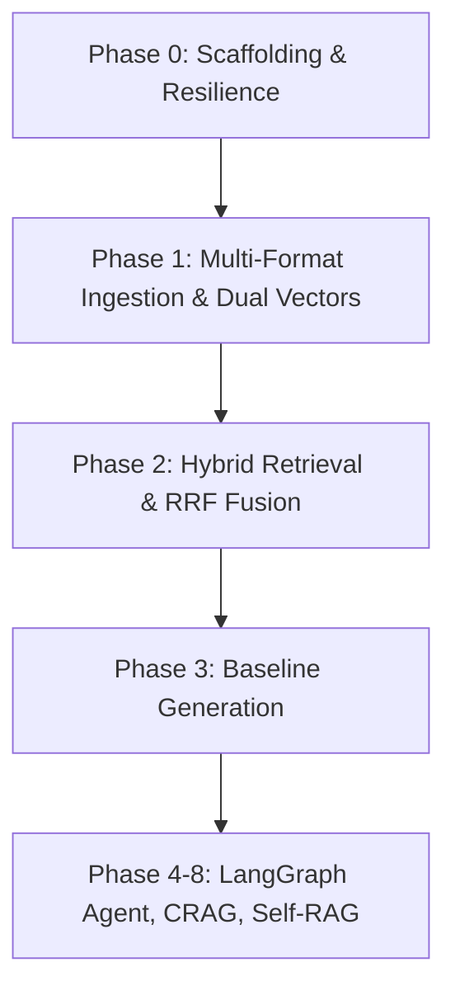

# AMCH-RAG — Architecture & Interview Study Guide

> **Project Name**: AMCH-RAG (*Agentic Multi-Modal Corrective Hybrid RAG*)  
> **Target Audience**: Technical Interviewers, System Architecture Reviews, Senior AI Engineers  
> **Philosophy**: Quality > Quantity. Every line of code has a clear architectural purpose without gratuitous bloat.

---

## 1. High-Level Concept: What is AMCH-RAG?

Traditional RAG systems are **naive and linear**:
$$\text{Query} \longrightarrow \text{Vector Search} \longrightarrow \text{LLM Prompt} \longrightarrow \text{Response}$$

**The Problem**: If retrieval returns irrelevant documents, the model hallucinates. If the question contains an acronym or exact ID, vector search often misses it. If an external API is down or rate-limited, the entire system crashes.

**The Solution (AMCH-RAG)**:
An **autonomous, self-correcting RAG pipeline** that:
1. **Hybrid Retrieval**: Combines Dense semantic vectors + Sparse BM25 keyword vectors fused via Reciprocal Rank Fusion (RRF).
2. **Corrective RAG (CRAG)**: Evaluates retrieved document relevance. If poor, rewrites the query and retries; if corpus lacks data, safely falls back to labeled web search.
3. **Self-RAG Groundedness**: Checks the generated answer against source context before outputting; rejects hallucinations.
4. **Resilient Multi-Provider Gateway**: Google Gemini AI Pro as primary, with seamless automatic fallback to free tiers (Groq $\to$ OpenRouter).
5. **Zero-Cost / Crash-Proof Infrastructure**: Dual-mode storage (Embedded local Qdrant + SQLite cache fallback) requiring **zero paid databases** to run.

---

## 2. The Step-by-Step Flow: What We Did & Difficulties Faced



### Step 1: Foundation & Scaffolding (Phase 0)
- **Goal**: Build a production-grade directory layout, Pydantic settings, multi-provider LLM gateway, and dual-backend cache/vector store.
- **Key Decision**: Pinned Python 3.12 managed via `uv` for sub-second virtualenv resolution and Windows compatibility.
- **Difficulty Faced**:
  - *Challenge*: How to make the app resilient if external Redis or Qdrant containers aren't running?
  - *Solution*: Built dual-mode clients. If `REDIS_URL` or `QDRANT_URL` are not provided, it seamlessly switches to **embedded local Qdrant disk storage** (`./data/qdrant`) and **embedded local SQLite cache** (`./data/cache/cache.db`).

### Step 2: Multi-Format Ingestion & Dual Vectors (Phase 1)
- **Goal**: Ingest real-world documents (`.txt`, `.md`, `.docx`, `.pdf`), split them into boundary-aware chunks, and index them into Qdrant.
- **Key Decision**:
  - Built dedicated loaders for each format. For instance, Markdown extracts `#` headers to track sections; PDF tracks page numbers; DOCX extracts both paragraphs and table grids.
  - Used FastEmbed locally (`BAAI/bge-small-en-v1.5` for dense, `Qdrant/bm25` for sparse).
- **Difficulties Faced**:
  - *Challenge 1 (Windows Symlinks)*: On Windows, HuggingFace Hub attempts to create symlinks for model weights in `%TEMP%`, causing `[WinError 1314] A required privilege is not held`.
  - *Solution*: Set `HF_HUB_DISABLE_SYMLINKS_WARNING=1` and allowed FastEmbed's automatic snapshot fallback to load ONNX models cleanly without needing Windows Administrator / Developer mode.
  - *Challenge 2 (Cache Invalidation on Ingest)*: Ingesting a document must invalidate any cached Q&A that cited that document. Added a unified `clear()` and reverse-indexed document invalidation hook in `CacheManager`.

### Step 3: Hybrid Retrieval & Reciprocal Rank Fusion (Phase 2)
- **Goal**: Implement single-roundtrip hybrid retrieval uniting Dense semantic vector search + Sparse BM25 keyword matching with query-level tenant access filtering.
- **Key Decision**: Used Qdrant's `query_points` API with dual `prefetch` candidate pipelines and native `FusionQuery(fusion=Fusion.RRF)`.
- **Difficulties Faced**:
  - *Challenge 1 (Incompatible Score Distributions)*: Dense cosine similarity is bounded in $[-1, 1]$, whereas sparse BM25 scores are unbounded $[0, \infty)$. Linear combination ($\alpha \cdot S_{\text{dense}} + (1-\alpha) \cdot S_{\text{sparse}}$) requires dataset-specific manual tuning that breaks across different domains.
  - *Solution*: Reciprocal Rank Fusion (RRF). RRF scores items solely based on their reciprocal rank positions:
    $$\text{RRF}(d) = \sum_{m \in M} \frac{1}{k + r_m(d)}$$
    (with standard smoothing constant $k=60$). This completely bypasses arbitrary score calibration.
  - *Challenge 2 (Tenant & Security Isolation)*: How to enforce document access levels without memory post-filtering (which wastes retrieval compute and degrades top-$k$ yield)?
  - *Solution*: Evaluated security constraints inside Qdrant's native query engine using `query_filter=Filter(must=[FieldCondition(key="access_level", match=MatchValue(...))])`. Unauthorized points are never read from disk.
  - *Challenge 3 (FastAPI Event Loop Non-Blocking)*: Embedding computation and Qdrant local disk I/O are CPU/sync-bound.
  - *Solution*: Wrapped synchronous retrieval in `asyncio.to_thread` via `retriever.async_retrieve()` so the async web server remains non-blocking and fully responsive.

---

## 3. Core Components & Code Snippets (For Explaining in Interviews)

### Component 1: Multi-Provider Resilient LLM Gateway
> **Interview Question**: *"What happens if Gemini hits a 429 rate limit or goes down?"*  
> **Answer**: *"We implemented a Circuit Breaker Gateway with ordered failover. Gemini Pro is primary; if it fails or rate-limits, it instantly degrades to Groq (Llama 3.3 70B), then OpenRouter (DeepSeek R1), with zero user-facing downtime."*

```python
# app/gateway/client.py
class ModelGateway:
    async def generate(self, prompt: str, system_prompt: str = "") -> GatewayResponse:
        errors = []
        for provider_name in self.provider_priority:
            provider = self.providers.get(provider_name)
            if not provider or not provider.is_available():
                continue
            try:
                content = await provider.generate(
                    prompt=prompt, system_prompt=system_prompt
                )
                return GatewayResponse(content=content, provider=provider_name)
            except Exception as e:
                errors.append(f"{provider_name}: {str(e)}")
        raise RuntimeError(f"All providers exhausted: {'; '.join(errors)}")
```

---

### Component 2: Dual Dense + Sparse BM25 Vector Schema in Qdrant
> **Interview Question**: *"Why did you use Qdrant and why both dense and sparse vectors?"*  
> **Answer**: *"Dense vectors capture semantic intent ('heart attack'), but struggle with exact alphanumeric IDs or niche acronyms ('MI' or 'Error code 404'). Sparse BM25 vectors capture exact keyword frequencies. Storing both in a single Qdrant point lets us run hybrid search with Reciprocal Rank Fusion (RRF) in a single database round-trip."*

```python
# app/retrieval/vector_store.py
def ensure_collections(self):
    self.client.create_collection(
        collection_name="knowledge_base",
        vectors_config={"dense": VectorParams(size=384, distance=Distance.COSINE)},
        sparse_vectors_config={
            "sparse": SparseVectorParams(index=SparseIndexParams(on_disk=False))
        },
    )
```

---

### Component 3: Boundary-Aware Recursive Chunker
> **Interview Question**: *"Why not just use a naive character split (e.g., every 500 characters)?"*  
> **Answer**: *"Naive splits cut words in half and break sentences across boundaries, destroying semantic coherence. Our chunker recursively splits on double newlines (paragraphs), single newlines, sentence terminators (`. `, `? `, `! `), and spaces, while preserving document metadata (page number, section heading)."*

```python
# app/ingestion/chunker.py
class SemanticChunker:
    def __init__(self, chunk_size=600, chunk_overlap=100):
        self.chunk_size = chunk_size
        self.chunk_overlap = chunk_overlap
        self.separators = ["\n\n", "\n", ". ", "? ", "! ", " ", ""]

    def chunk_document(
        self, raw_parts, doc_id, source, source_type, access_level="default"
    ):
        # Preserves section title, page number, and sequential chunk_index
        ...
```

---

### Component 4: Fixed Local Embedding Engine (FastEmbed)
> **Interview Question**: *"Why didn't you failover the embedding model like you did with the LLM?"*  
> **Answer**: *"Different embedding models project text into completely incompatible vector spaces (e.g. 384-dim vs 768-dim vs 1536-dim). If you switch embedding models mid-stream, existing vector store points become un-retrievable. Therefore, embeddings MUST remain strictly fixed and deterministic. By running FastEmbed locally with ONNX (`BAAI/bge-small-en-v1.5`), embeddings are 100% free, run locally on CPU, and never suffer network timeouts."*

```python
# app/retrieval/embeddings.py
class EmbeddingEngine:
    def embed_dense(self, texts: list[str]) -> list[list[float]]:
        # FastEmbed runs ONNX-quantized models with zero PyTorch GPU bloat
        return [e.tolist() for e in self.dense_model.embed(texts)]

    def embed_sparse(self, texts: list[str]) -> list[SparseVectorData]:
        # Generates BM25 token frequencies as sparse vectors
        return [
            SparseVectorData(indices=e.indices.tolist(), values=e.values.tolist())
            for e in self.sparse_model.embed(texts)
        ]
```

---

### Component 5: Asynchronous Ingestion & Background Task Job Store
> **Interview Question**: *"How do you handle ingestion of large PDFs without blocking the API?"*  
> **Answer**: *"The `/ingest` route immediately responds with `202 Accepted` and a unique `job_id`. Processing runs in FastAPI background workers. Clients poll `GET /ingest/{job_id}` to track status (`pending` $\to$ `processing` $\to$ `completed`) and get the total chunk count."*

```python
# app/api/routes_ingest.py
@router.post("", status_code=status.HTTP_202_ACCEPTED, response_model=IngestJob)
async def ingest_document(
    background_tasks: BackgroundTasks, file: UploadFile = File(...)
):
    job_id = str(uuid.uuid4())
    job = job_store.create_job(job_id=job_id, filename=file.filename)
    background_tasks.add_task(
        _process_file_background, job_id, temp_path, file.filename
    )
    return job
```

---

### Component 6: Single-Roundtrip Hybrid Retrieval & RRF Fusion
> **Interview Question**: *"Why did you use Reciprocal Rank Fusion instead of a linear weighted sum like $0.7 \cdot \text{Dense} + 0.3 \cdot \text{BM25}$?"*  
> **Answer**: *"Linear weighted combinations require min-max or sigmoid score calibration because cosine similarity is bounded in $[-1, 1]$ while BM25 is unbounded $[0, \infty)$. If a query contains a rare term, BM25 scores spike and drown out dense relevance. RRF is scale-invariant: it ranks documents solely by their positions in each list: $\sum \frac{1}{60 + \text{rank}(d)}$. Documents appearing near the top of both lists receive the highest fused priority."*

```python
# app/retrieval/vector_store.py & app/retrieval/retriever.py
class HybridRetriever:
    def retrieve(self, query: str, limit: int = 10, access_levels: list[str] | None = None) -> list[RetrievedChunk]:
        dense_vec = self.embedding_engine.embed_query_dense(query)
        sparse_vec = self.embedding_engine.embed_query_sparse(query)

        # Single round-trip to Qdrant: prefetch dense + sparse candidates, then fuse via RRF
        points = self.vector_mgr.client.query_points(
            collection_name="knowledge_base",
            prefetch=[
                Prefetch(query=dense_vec, using="dense", limit=40),
                Prefetch(query=SparseVector(indices=sparse_vec.indices, values=sparse_vec.values), using="sparse", limit=40),
            ],
            query=FusionQuery(fusion=Fusion.RRF),
            query_filter=Filter(must=[FieldCondition(key="access_level", match=MatchAny(any=access_levels))]),
            limit=limit,
        )
        return [RetrievedChunk.from_point(p) for p in points]
```

---

## 4. Key Interview Talking Points (Quick Fire)

| Topic | Talking Point |
|---|---|
| **Tech Stack Choice** | FastAPI (async API), LangGraph (stateful cyclical agent), Qdrant (native hybrid vectors), FastEmbed (local ONNX embeddings), Gemini Pro + Groq/OpenRouter (resilience). |
| **Data Privacy & Tenancy** | Every chunk carries an `access_level` attribute (e.g. `public`, `admin`). Query filtering is enforced directly inside the Qdrant query filter, preventing unauthorized chunk retrieval at the database level. |
| **Why Reciprocal Rank Fusion (RRF)** | Dense search scores (cosine similarities) and BM25 scores (token statistics) operate on totally different scales. RRF uses rank positions ($\frac{1}{60 + \text{rank}}$) instead of raw scores to fairly merge the two lists without fragile score normalization. |
| **Cache Strategy** | Two tiers: (1) Exact normalized query SHA-256 hash cache (<5ms response time), (2) Semantic similarity cache (>0.90 cosine threshold) for paraphrased questions. |
| **Self-Correction (CRAG)** | Rather than blindly trusting retrieved context, an LLM grader checks relevance. If below threshold, a query rewriter attempts up to 2 reformulated searches before safely falling back to web search. |

---
*Created and maintained as a companion guide for AMCH-RAG development and interview preparation.*
